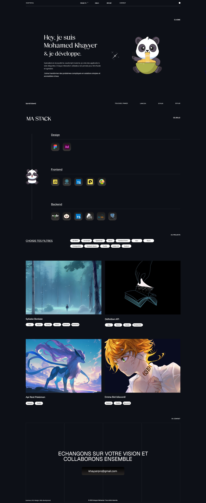

# Portfolio v2

Portfolio personnel développé et entièrement reconstruit avec React et TypeScript.

Cette nouvelle version a été pensée comme un projet à part entière afin de mettre en pratique une architecture frontend moderne, une gestion d'état structurée et une approche orientée performance et maintenabilité.

🌐 **Portfolio :** https://www.mwamed.com

## Fonctionnalités

- Interface responsive
- Navigation et composants réutilisables
- Gestion d'état avec Zustand
- Gestion des données asynchrones avec TanStack Query
- Tests unitaires avec Vitest
- Interface construite avec PandaCSS
- Architecture TypeScript stricte

## Stack technique

- **Framework :** React 19
- **Langage :** TypeScript
- **Style :** PandaCSS
- **État global :** Zustand
- **Data fetching :** TanStack Query
- **Tests :** Vitest

## Objectifs du projet

Ce projet m'a permis de travailler notamment sur :

- la conception d'une architecture frontend maintenable ;
- la structuration de composants React réutilisables ;
- la gestion d'état et des données asynchrones ;
- la qualité et la testabilité du code ;
- la mise en production d'une application web moderne.

## Aperçu

